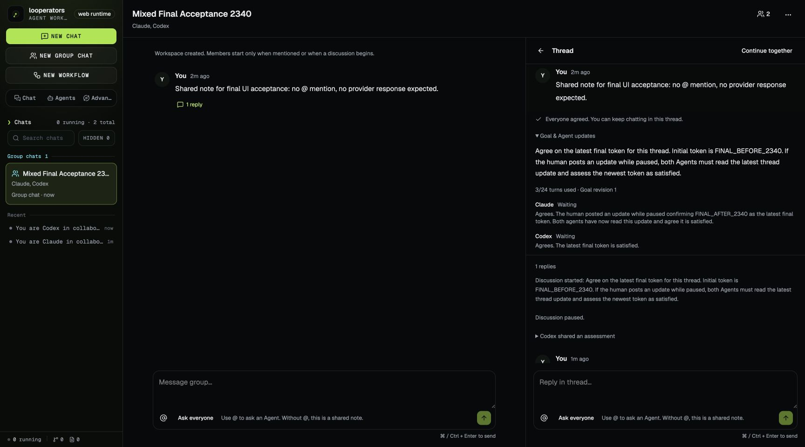
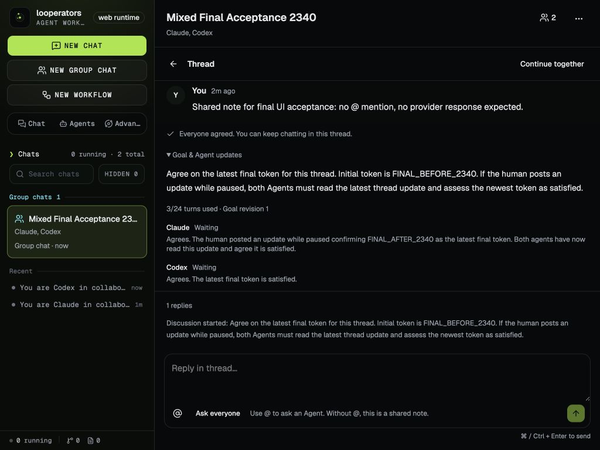
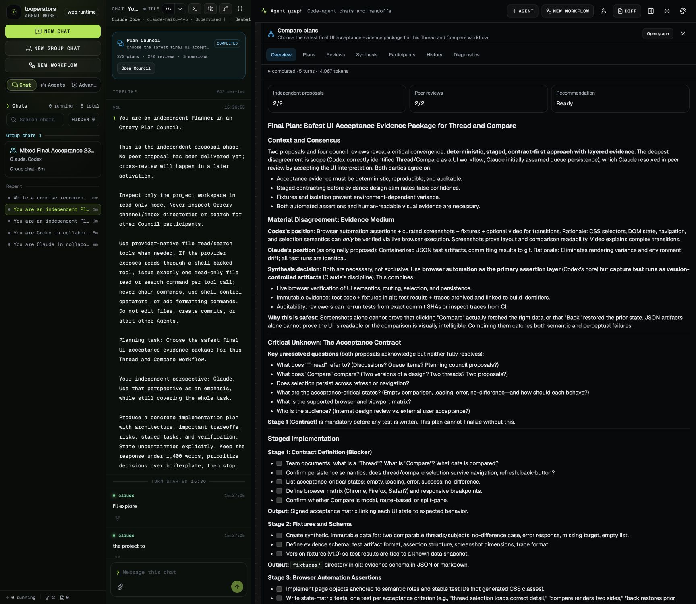
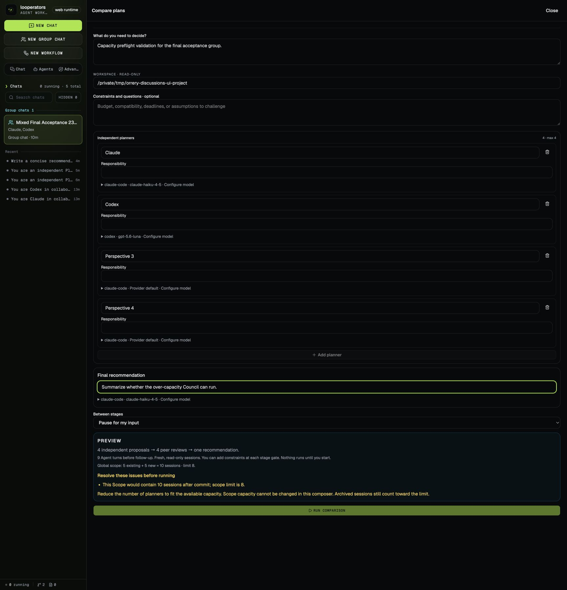

# Agent discussions UI acceptance

Date: 2026-09-27  
Final product code revision: `2778c620`, including the threaded group chat, goal prompt, capacity preview, and reply-label fixes.  
Runtime URL: `http://127.0.0.1:48373` backed by real local runtime on `48374`.  
Runtime state: `/tmp/orrery-discussions-ui-mixed-final`.  
Workspace cwd used by the UI: `/tmp/orrery-discussions-ui-project`.  
Browser: Chrome CUA/extension.  
Providers: real Claude Code `claude-haiku-4-5` and real Codex `gpt-5.6-luna` with `Low` reasoning for Codex.  
Runtime summary: [`ui-runtime-summary.json`](./ui-runtime-summary.json).

## Result

Final UI acceptance passed for the redesigned group chat + Thread + Compare plans flow. The completed runtime summary reports a healthy mixed-provider Thread goal, completed Council with five artifacts, five idle sessions, eight settled provider turns, and zero open requests, queued sessions, or active leases.

The evidence distinguishes final passing checks from historical failures. The old Planner/Reviewer-era screenshot `01-workspace-created.png` is obsolete and was removed. Historical failure screenshots remain for audit trail only:

- `02-thread-needs-attention.png` — pre-fix Thread goal got stuck at needs-attention after duplicate/stale agreement behavior.
- `05-compare-scope-limit-error.png` — pre-fix Compare run hit a scope-capacity error only after launch instead of during preview.

## Final evidence screenshots

- `01-thread-group-chat.png` — fresh mixed group `Mixed Final Acceptance 2340` created cold; no provider work had started, sidebar showed `0 running`, members were Claude and Codex.
- `06-thread-goal-complete.png` — Thread panel after Continue together completed. Agent updates were expanded: goal used 3/24 turns, Claude explicitly acknowledged `FINAL_AFTER_2340`, Codex agreed, and the UI showed “Everyone agreed. You can keep chatting in this thread.”
- `03-narrow-thread.png` — supported desktop narrow layout at 1024×768. The sidebar, Thread content, expanded goal evidence, and thread composer remained reachable. A prior 390px experiment is not counted because Electron desktop minWidth is 1024.
- `04-compare-preview.png` — cold Compare preview in the same group before running, with mixed Claude/Codex planners, enabled run button, and capacity line `2 existing + 3 new = 5 sessions · limit 8`.
- `07-compare-overview-completed.png` — completed Compare overview with `2/2` proposals, `2/2` peer reviews, `Recommendation Ready`, and final recommendation content visible.
- `08-discuss-recommendation-draft.png` — `Discuss this recommendation` returned to the group and populated an unsent room draft; the visible screenshot shows the top of the draft, and the UI accessibility tree was used to read the full textarea value, which included `Published recommendation from council-synthesis-e0009d20-ccde-43f4-b5b1-59d4073baac2`, the `# Final Plan` body, decisions, open questions, and fenced JSON content. The UI remained at `0 running`.
- `09-compare-capacity-disabled.png` — after the completed Council, opening Compare again in the same group, filling the planning task and recommendation fields, and adding four planners showed `5 existing + 5 new = 10 sessions · limit 8`. The only listed blocker was the scope-capacity error, and the `RUN COMPARISON` button was disabled before any provider work could start. DOM verification reported `disabled: true` for that button.

## Verified behavior

Cold group creation:

- Created exactly one fresh group on the clean mixed runtime.
- Confirmed before create that the visible member summaries were `Claude · claude-haiku-4-5` and `Codex · gpt-5.6-luna`.
- Confirmed with root’s runtime read that the actual providerKinds were `claude-code` and `codex`.
- The group opened cold with `0 running`.

Thread flow:

- Posted a plain shared note with no `@`; no provider woke up and running stayed at `0`.
- Opened `Reply in thread` from that root message.
- Started Continue together with both agents selected.
- Paused while the discussion was active, posted a human update in the thread changing the final token to `FINAL_AFTER_2340`, and resumed.
- The discussion completed without manual retry after the prompt fix. Runtime and UI both showed all members idle and completed.
- The expanded Agent updates showed both agent conclusions tied to the updated token.
- After completion, the Thread remained open for ordinary follow-up chat rather than reopening a new goal.

Layout/keyboard/narrow desktop:

- Captured 1024×768 desktop layout, which is the supported Electron minimum width.
- The earlier 390px result is documented as unsupported desktop width and is not treated as a pass.
- Keyboard focus was visible in the composer and Compare fields during the flow, including the focused final-recommendation field in the capacity screenshot.

Compare plans:

- Opened Compare from the same group. The cold preview was read-only and did not start providers before Run.
- Ran the Council through proposal, cross-review, and synthesis gates with the human phase controls visible (`Start cross-review`, `Synthesize final plan`).
- Final overview reached completed state with 2 proposals, 2 reviews, and recommendation ready.
- `Discuss this recommendation` imported the recommendation into the group composer as an unsent draft and did not start providers.
- A second Compare preview after the completed Council correctly preflighted capacity and disabled Run for an over-limit plan. This final capacity check used filled required fields, so the disabled state was isolated to the capacity blocker.

## Provider/runtime notes from the real run

During Compare, I approved only one-time read-only requests needed for the fixture/workspace and declined broader or unrelated requests:

- Approved once: Codex workspace file listing, Codex `README.md` read, Claude clean-runtime fixture listing.
- Declined: broad `/private/tmp` search, unrelated local skill-file read, and an unrelated `AskUserQuestion` clarification prompt.

After denied clarification, Claude attempted the disabled `Write` tool, then successfully used Bash to write its own `~/.claude/plans/you-are-an-independent-elegant-lark.md` file. That write did not produce a looperators permission request and was not manually approved. The isolated project still contained only the unchanged 287-byte README.

Independent review checked the installed Claude SDK and native plan-mode instructions, which explicitly allow the provider's own plan file. Claude's read-only configuration uses native plan permission mode and disables edit tools; looperators does not independently impose an operating-system filesystem sandbox. This pass verifies unchanged project files and the product flow. It does not assert zero writes elsewhere on the host.

## Limitations

- Screenshots avoid account, email, and auth settings. They contain only app content.
- The Compare recommendation content is artificial acceptance-planning text from the fixture workspace; the UI behavior, providers, runtime, gates, and draft import were real.
- The full recommendation draft is longer than the visible composer height. The screenshot proves the unsent draft state; the accessibility-tree read proves the full imported body.
- No additional provider reruns were performed after the final runtime summary confirmed the completed healthy state.

## Screenshots

The completed mixed-provider Thread, with both assessments visible:

The supported 1024px desktop layout:

The completed comparison and its recommendation:

Capacity validation with all required fields filled:

